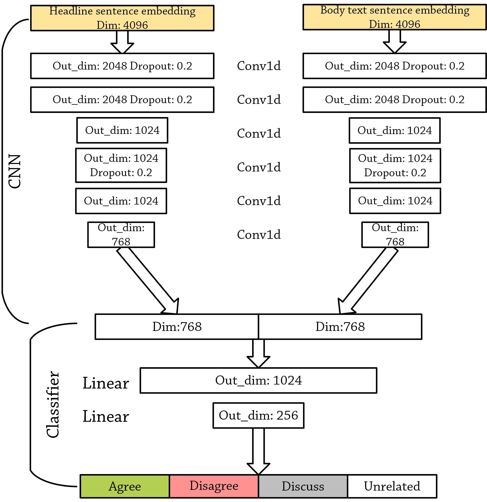
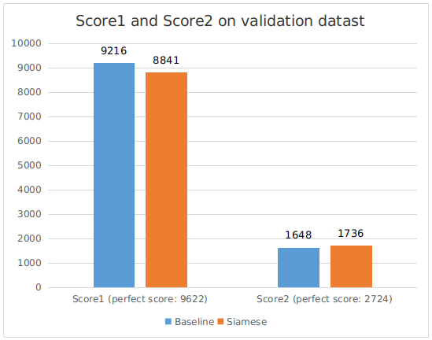
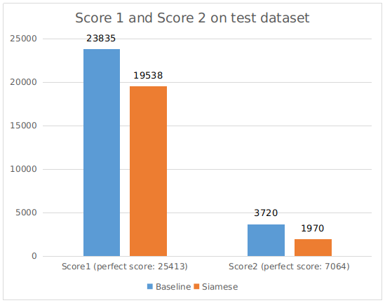

# CMPT 413 Project

## Introduction

As media becomes the main source of important news, the authenticity of those news becomes one of the most important things. The ultimate goal of the Fake News Challenge is meant to identify fake news through computers automatically. In order to achieve this ultimate goal, people need to approach the ideal results step by step. At the first step of this challenge, people need to teach computers to classify whether a headline and the associated body text are related or not. The baseline method provided by the organizers of this challenge is a gradient boosting classifier associated with 10-fold cross-validation. In this project, we propose a deep learning model using the idea Siamese model to check whether a headline and a body text are related. We first extract features from headlines and body texts using one-dimensional CNN respectively. And then we implement an MLP classifier to decide the relationship between a headline and the associated body text. The relationship between a headline and a body text contains agree, disagree, discuss, or unrelated. 

## Approach
### Baseline method

The baseline method is indicated in the https://github.com/FakeNewsChallenge/fnc-1-baseline

### Deep learning model 

## Results

### Baseline method 

#### Validation dataset

|               | agree         | disagree      | discuss       | unrelated     |
|-----------    |-------        |----------     |---------      |-----------    |
|   agree       |    115        |     8         |    557        |    82         |
| disagree      |    16         |     3         |    128        |    15         |
|  discuss      |    60         |     3         |    1530       |    207        |
| unrelated     |    5          |     1         |    96         |    6796       |

Score: 3540.0 out of 4448.5	(79.58%)

#### Test dataset
|               | agree         | disagree      | discuss       | unrelated     |
|-----------    |-------        |----------     |---------      |-----------    |
|   agree       |    167        |     11        |   1439        |   286         |
| disagree      |    36         |     7         |   416         |   238         |
|  discuss      |    228        |     14        |   3546        |   676         |
| unrelated     |    9          |     3         |   364         |   17971       |

Score: 8761.75 out of 11651.25     (75.09%)

### Deep learning model

#### Train dataset
|               | agree         | disagree      | discuss       | unrelated     |
|-----------    |-------        |----------     |---------      |-----------    |
|   agree       |    1770       |     99        |    736        |    311        |
| disagree      |    125        |     380       |    104        |    69         |
|  discuss      |    19         |     0         |    6708       |    382        |
| unrelated     |    +          |     0         |    36         |    29605      |

Score: 16530.0 out of 18114.75	(91.25%)

#### Validation dataset

|               | agree         | disagree      | discuss       | unrelated     |
|-----------    |-------        |----------     |---------      |-----------    |
|   agree       |    325        |     20        |    261        |    156        |
| disagree      |    33         |     55        |    44         |    30         |
|  discuss      |    116        |     12        |    1356       |    316        |
| unrelated     |    60         |     16        |    203        |    6619       |

Score: 3512.25 out of 4448.5	(78.95%)

#### Test dataset
|               | agree         | disagree      | discuss       | unrelated     |
|-----------    |-------        |----------     |---------      |-----------    |
|   agree       |    268        |     65        |   275         |   1277        |
| disagree      |    94         |     14        |   110         |   479         |
|  discuss      |    303        |     38        |   1670        |   2453        |
| unrelated     |    451        |     128       |   1087        |   16683       |

Score: 6362.0 out of 11651.25      (54.60%)

## Conclusion
In natural language processing, although the semantics are important, the word-level features can also have huge impacts on the task we are going to achieve. For fake news stance detection, although it looks like to identify the relationship among sentences since we are dealing with the stances between headlines and body texts, the word-level information is still important since there are words like “deny” and “fake” that can determine the stances between headlines and body texts with only one word. And the number of words in the headline that appears in the body text is another important feature since we can decide how close the headline and the body text are related. Instead of using word embeddings, using sentence embeddings can improve the efficiency of our model. However, the model improves efficiency at the expense of flexibility and accuracy. Thus, it is hard for our model to keep high accuracy after changing the body texts used as the input of our model.   
Although our method has worse performance on the test dataset than the performance of using the baseline method, we think our method is still an available model for fake news stance detection since the performance on the validation dataset is still acceptable. We believe that using word embeddings will give us better results since we keep the word-level information and using word embeddings can resist the change of headlines and body texts. 

## References
Sean Baird, Doug Sibley, and Yuxi Pan. 2017.   Talostargets disinformation with fake news challenge victory.   

Jane  Bromley,   James  W  Bentz,   L ́eon  Bottou,   Is-abelle  Guyon,  Yann  LeCun,  Cliff  Moore,  EduardS ̈ackinger, and Roopak Shah. 1993. Signature verifi-cation using a “siamese” time delay neural network.International Journal of Pattern Recognition and Ar-tificial Intelligence, 7(04):669–688.  

Alexis Conneau, Douwe Kiela, Holger Schwenk, Lo ̈ıcBarrault,  and  Antoine  Bordes.  2017.    Supervisedlearning of universal sentence representations fromnatural language inference data.  InProceedings ofthe 2017 Conference on Empirical Methods in Nat-ural Language Processing, pages 670–680, Copen-hagen,   Denmark.  Association  for  ComputationalLinguistics.  

William  Ferreira  and  Andreas  Vlachos.  2016.   Emer-gent:  a novel data-set for stance classification.   InProceedings  of  the  2016  conference  of  the  NorthAmerican  chapter  of  the  association  for  computa-tional  linguistics:   Human  language  technologies,pages 1163–1168.  

Andreas    Hanselowski,Avinesh    PVS,    BenjaminSchiller,Felix    Caspelherr,Debanjan    Chaud-huri,   Christian   M   Meyer,   and   Iryna   Gurevych.2018.A  retrospective  analysis  of  the  fake  newschallenge  stance  detection  task.arXiv  preprintarXiv:1806.05180.  

Dean Pomerleau and Delip Rao. 2017.  the fake newschallenge: Exploring how artificial intelligence tech-nologies could be leveraged to combat fake news.  

Benjamin Riedel, Isabelle Augenstein, Georgios P Sp-ithourakis,  and  Sebastian  Riedel.  2017.A  sim-ple  but  tough-to-beat  baseline  for  the  fake  newschallenge  stance  detection  task.arXiv  preprintarXiv:1707.03264. 

